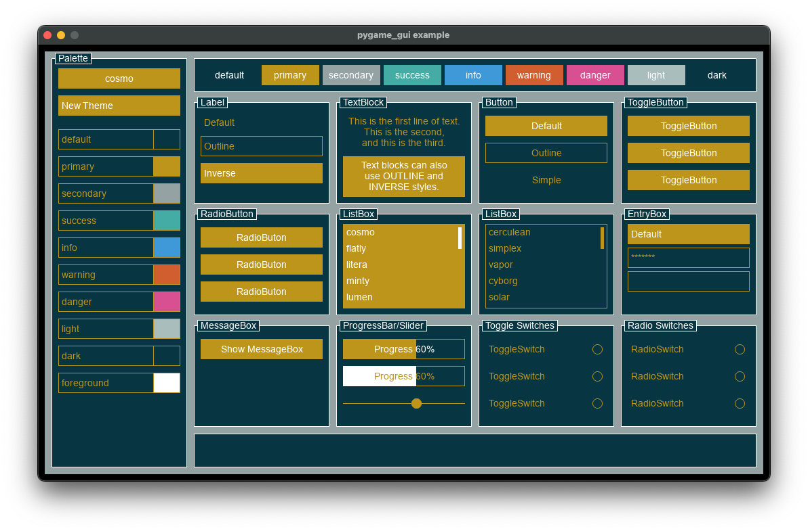
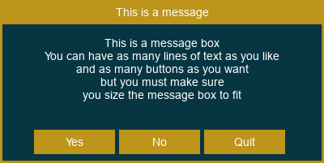
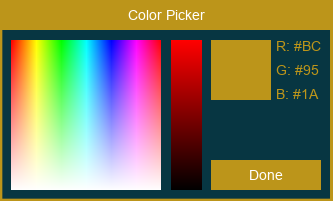

# pygame_gui
# A simple gui library for pygame.



Install: 

`pip install git+ssh://git@github.com/Barrowcroft/pygame_gui.git`

or 

`uv add git+https://git@github.com/barrowcroft/pygame_gui.git`

### Overview

pygame_gui provides a simple set of gui elements for use with pygame. 

These include; 

#### Control

```
class Control:
    """The 'Control' class."""

    def __init__(
        self, 
        parent: Control | None, 
        position: tuple[int, int], 
        size: tuple[int, int]
    ) -> None:
```

#### Frame

```
class Frame(Control):
    """The 'Frame' class."""

    def __init__(
        self,
        parent: Control | None,
        position: tuple[int, int],
        size: tuple[int, int],
        caption: str | None = None,
    ) -> None:
```

#### Label

```
class Label(Frame):
    """The 'Label' class."""

    def __init__(
        self,
        parent: Control | None,
        position: tuple[int, int],
        size: tuple[int, int],
        text: str,
    ) -> None:
```

### TextBlock

```
class TextBlock(Frame):
    """The 'TextBlock' class."""

    def __init__(
        self,
        parent: Control | None,
        position: tuple[int, int],
        size: tuple[int, int],
        text: list[str],
    ) -> None:
```

#### Button

```
class Button(Label):
    """The 'Button' class."""

    def __init__(
        self,
        parent: Frame | None,
        position: tuple[int, int],
        size: tuple[int, int],
        text: str,
        callback: Callable[[], None],
    ) -> None:
```

#### ToggleButton

```
class ToggleButton(Label):
    """The 'ToggleButton' class."""

    def __init__(
        self,
        parent: Frame | None,
        position: tuple[int, int],
        size: tuple[int, int],
        text: str,
        callback: Callable[[], None],
    ) -> None:
```

#### RadioButton

```
class RadioButton(Label):
    """The 'RadioButton' class."""

    def __init__(
        self,
        parent: Frame | None,
        position: tuple[int, int],
        size: tuple[int, int],
        text: str,
        callback: Callable[[], None],
    ) -> None:
```

#### MenuButton

```
class MenuButton(Label):
    """The 'MenuButton' class."""

    def __init__(
        self,
        parent: Frame | None,
        position: tuple[int, int],
        size: tuple[int, int],
        callback: Callable[[str], None],
        texts: list[str],
    ) -> None:
```

### ToggleSwitch

```
class ToggleSwitch(Label):
    """The 'ToggleSwitch' class."""

    def __init__(
        self,
        parent: Frame | None,
        position: tuple[int, int],
        size: tuple[int, int],
        text: str,
        callback: Callable[[], None],
    ) -> None:
```

#### RadioSwitch

```
class RadioSwitch(Label):
    """The 'RadioSwitch' class."""

    def __init__(
        self,
        parent: Frame | None,
        position: tuple[int, int],
        size: tuple[int, int],
        text: str,
        callback: Callable[[], None],
    ) -> None:
```

#### EntryBox

```
class EntryBox(Frame):
    """The EntryBox control."""

    def __init__(
        self,
        parent: Control | None,
        position: Tuple[int, int],
        size: Tuple[int, int],
        text: str = "",
        callback_on_change: Callable[[str], None] | None = None,
        callback_on_exit: Callable[[str], None] | None = None,
        secret: bool = False,
    ) -> None:
```

#### ProgressBar

```
class ProgressBar(Frame):
    """The ProgressBar class."""

    def __init__(
        self,
        parent: Control | None = None,
        position: tuple[int, int] = (0, 0),
        size: tuple[int, int] = (100, 30),
        text: str = "",
        percent: int = 0,
    ) -> None:
```

#### Slider

```
class Slider(Frame):
    """The Slider class."""

    def __init__(
        self,
        parent: Control | None,
        position: tuple[int, int],
        size: tuple[int, int],
        callback: Callable[[int], None],
        percent: int = 0,
    ) -> None:
```

#### ListBox

```
class ListBox(Frame):
    """The 'ListBox' class."""

    def __init__(
        self,
        parent: Control | None,
        position: tuple[int, int],
        size: tuple[int, int],
        items: list[str],
        item_height: int,
        callback: Callable[[str], None],
    ) -> None:
```

### Additional

There is also a MessageBox and ColorPicker.

#### MessageBox

```
class MessageBox(Panel):
    """The 'MessageBox' class."""

    def __init__(
        self,
        position: tuple[int, int],
        size: tuple[int, int],
        title: str,
        message_texts: list[str] | None = None,
        button_texts: list[str] | None = None,
        callback: Callable[[str], None] | None = None,
        center: bool = True,
    ) -> None:
```



#### ColorPicker

```
class ColorPicker(Panel):
    """The 'ColorPicker' class."""

    def __init__(
        self,
        position: tuple[int, int],
        size: tuple[int, int],
        callback: Callable[[str], None] | None = None,
        center: bool = True,
    ) -> None:
```



### Game loop

The basic pygame loop looks somehting like this, with a handle_event, update and render phase.

```
 def run(self) -> None:
        """Main."""

        # Main loop

        _running: bool = True

        while _running:

            for event in pygame.event.get():

                if event.type == pygame.QUIT:
                    _running = False

                if event.type
                    in (
                        pygame.MOUSEBUTTONDOWN,
                        pygame.MOUSEBUTTONUP,
                        pygame.MOUSEMOTION,
                    ):
                    self._main.handle_mouse_event(event)

                self._main.update

                self._main.render(self._screen)

        # Quit Pygame

        pygame.quit()
```

### Events

The events generated by the gui elements need to handled within the event handling phase of the game loop.

Assuming that all gui elements are children of one control / frame called 'self._main' most events can be handled with:

``` 
self._main.handle_mouse_event(event)
```

Some elements such as the MessageBox, ColorPicker, or those with submenus, that is the MenuButton or SelectionBox need to be handled before the rest of the gui elements. This is to support their modal behaviour. In that case you can do something like this - assuming there is a MessageBox called 'self._message_box', and MenuButton called 'self._menu_button.'

```
if (
    event.type
    in (
        pygame.MOUSEBUTTONDOWN,
        pygame.MOUSEBUTTONUP,
        pygame.MOUSEMOTION,
    )
    and (
        not self._message_box.showing
        or not self._message_box.handle_mouse_event(event)
    )
    and (
        not self._menu_button.menu.showing
        or not self._menu_button.menu.handle_mouse_event(event)
    )
):
    self._master.handle_mouse_event(event)
```

The mehod 'handle_mouse_event' will return True if it has exhaustively handled the event and no futher gui elements should attemtop to handle it.

### Updating

The gui elements will need an chance to update; the ListBox in particular, during the update phase of the game loop.

Assuming that all gui elements are children of one control / frame called 'self._main' it is sufficient to do this:

``` 
self._main.update(dt)
```

Where 'dt' is a float representing delta time. 

Delta time is actually ignored but kept in for consistency with pygame_engine (https://github.com/Barrowcroft/pygame_engine).


### Rendering

The gui elements needs to be rendered within the rendering phase of the game loop.

Assuming that all gui elements are children of one control / frame called 'self._main' it is sufficient to do this:

``` 
self._main.render(self._screen)
```

Where 'self._screen' is the pygame surface on which to render.

The 'render' method of the game loop may look somehting like this:

```
def render(self, screen: pygame.Surface) -> None:
    """Renders the controls."""

    # Clear the screen.

    screen.fill((0, 0, 0, 1))

    # Render '_main' control / frame with it's children gui elements.

    self._main.render(screen)

    # Notice that MessageBox, ColorPicker must be rendered after the 
    # main gui elements; this is to ensure they appear on top of other gui
    # elements.

    self._message_box.render(screen)
    self._color_picker.render(screen)

    # So too with the menu part of the MenuButton and SelectionBox.
    
    self._menu_buton_1.render_menu(screen)
    self._selection_box_8_1.render_menu(screen)

    # Update the display

    pygame.display.flip()
```

### Styles

pygame_gui styling is inspired by ttkbootstrap (by israel-dryer, https://ttkbootstrap.readthedocs.io/en/latest/) and by the boostrap CSS package (https://getbootstrap.com). That being said, pygame_gui does not attempt to reproduce anywhere near the range of widgets or the degree of flexibility of those packages.

The default styles are based on those in ttkbootstrap.

Each gui element has a style and style modifier.

The style can be one of: default, primary, secondary, success, info, warning, danger, light or dark.

The style modifier can be one of: default, outline, simple or inverse.

Not all gui elements can take all style modifiers. 

The following table shows which style modifiers can be applied to each gui element.

| Element | Allowed style modifiers |
|---------|-------------------------|
| Control | None as Control is not rendered. |
| Frame | Default, Outline |
| Label | Default, Outline, Inverse |
| TextBlock | Default, Outline, Inverse |
| Button | Default, Outline, Simple |
| ToggleButton | Default, Outline, Simple |
| RadioButton | Default, Outline, Simple |
| MenuButton | Default, Outline, Simple |
| ToggleSwitch | Default  |
| RadioSwitch | Default  |
| EntryBox | Default, Outline |
| ProgressBar | Default, Inverse  |
| Slider | Default, Outline, Inverse  |
| ListBox | Default, Outline  |

### Theme Editior

The theme editor provides a simple way of editing themes.


